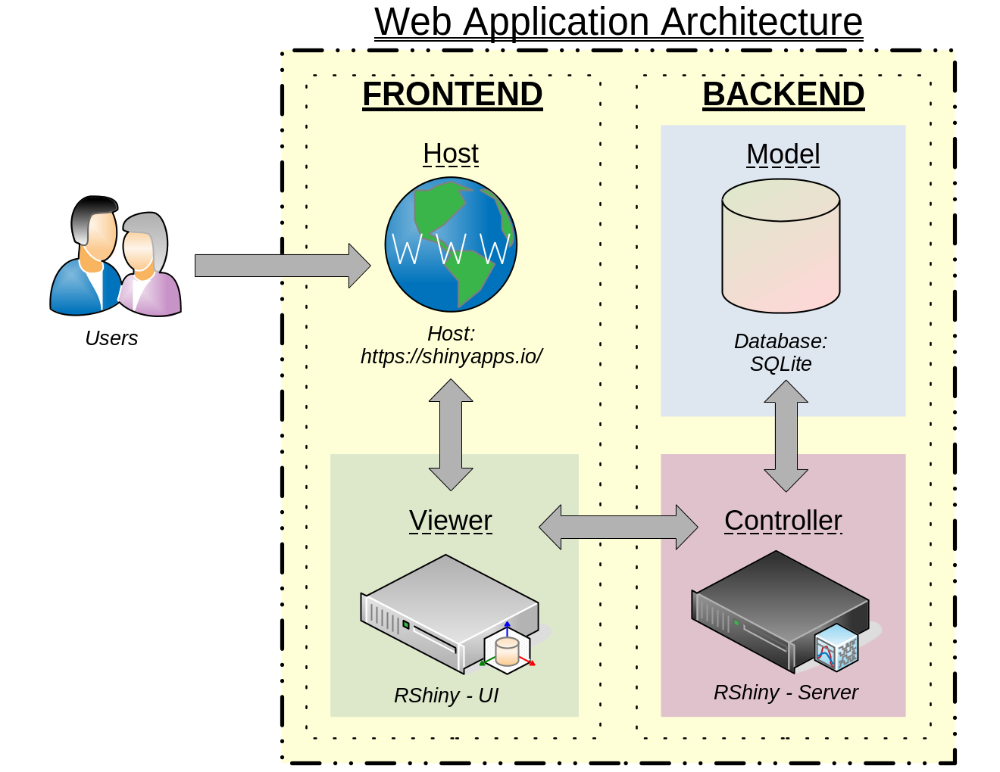
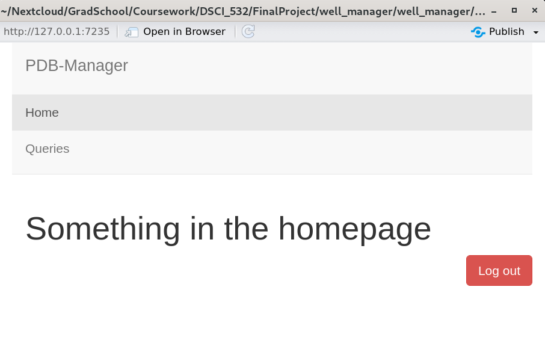
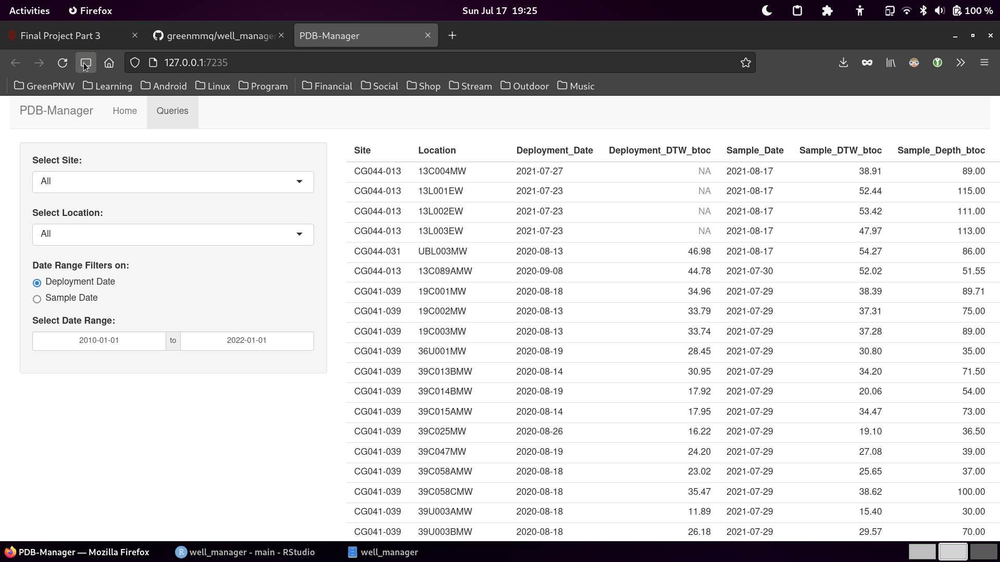

\newpage

# Introduction

Passive Diffusion Bag (PDB) sampling is becoming a more common practice for long-term groundwater monitoring sites in the environmental industry due to it's potential cost-savings for sites with volatile organic compounds (VOC) as the contaminants-of-concern (COC). However, current methods (manually updated excel spreadsheets...) for managing PDB deployments and sampling can be cumbersome for operations teams. The *PDB Manager* web application aims to solve this issue by providing an user interface for recording PDB deployment/sampling information and efficiently tracking and querying these data from a database. 

Previously, the database design was discussed in detail from the transformation of the original dataset to the development of SQL statements for performing CREATE, READ, and UPDATE operations on the database in accordance with the PDB deployment/sampling model. This report was comprehensive for the most critical functionality of the web application, although a couple other features are planned including:

- Analyzing existing database to determine which wells currently have PDBs deployed to them, and applying the `deployPDB()` function as necessary to accurately reflect this in the database. 
- Adding functionality to existing queries to allow filtering on wells with/without PDBs currently deployed. 
- Adding feature to allow assignment of lot numbers in batch by date range.
    + additional table for lot number assignment by date range
    + modify read queries to join lot numbers

The optional features may or may not be added by the end of this project. In either case, they will not be documented further in this report. 

This report discusses the web application architecture and layout for the *PDB Manager* application in the sections below. 

\newpage

# Section 1: Web Application Architecture

## MVC Design

> A typical web application follows a MVC schema.
> 
> - **Model**: The backend that contains all the data logic
> - **View**: The frontend or graphical user interface (GUI)
> - **Controller**: The brains of the application that controls how data is displayed
>
> -Final Project part 3 description
>

The *PDB Manager* architecture follows the MVC design as specified above. In this case, the **Model** is a SQLite database. This is where the database is stored, and SQL is used to Create, Read, and Update data as necessary. 

Next, the **Controller** is the RShiny application *server* script. The server script handles the interactions between R input variables and the SQLite database using the `RSQLite` and `DBI` packages. 

Finally, the **Viewer** is the RShiny application *ui* script. The ui script routes maps the user interface to input variables for the server, and renders messages and objects (tables) as specified by the server. The ui script also governs the overall front-end layout and appearance of the user interface, and incorporates other web elements (css, html, images, etc.) as necessary. 

A diagram of the application architecture is shown below:

## Access and Interactivity

These three MVC components, and any supporting objects, are hosted for free on RShiny Server using https://shinyapps.io/. Access to the application will be provided by the `shinyauthr` [package](https://paul.rbind.io/shinyauthr/). When the user provides an acceptable username/password then access to the application functions will be provided. The general interactivity for the user will include the ability to input and select data, as well as view tables. 

\newpage

# Section 2: Web Application Layout

The *PDB-Manager* application is designed to be an internally facing enterprise application. Thus, the initial layout given will be a user login screen. No other elements will be displayed until correct credentials are provided as part of the enterprise security protocol. 

Once authenticated, the user is taken to an initial homepage. The content of this homepage will be some basic information about the using the application, and external links. A logout button exists for when a user completes their session. 

The various menu options will be available as tabs on a navigation panel at the top of the screen. In addition to the homepage, there are the following tabs:

1. `Explore`
    - The Explore tab allows users to run read queries pdb deployment and sampling data. 
    - A sidebar panel provides inputs to filter the data, and a table displaying the results is rendered on the main panel.
        + `TODO` make the table interactive
        + `TODO` Add 'filter on PDB in well' feature

2. `Update`
    - The Update tab allows users to input data. Two options exist for standard users:
        a. deploy_pdb() function
        b. collect_sample() function
    - This tab will consist of a conditional reactive user interface dialog which will output a confirmation message or appropriate error message to the user, as applicable
    - No screenshot as this is not yet developed
    
3. `Admin`
    - The Admin tab will allow for some admin functionalities, like provisioning user accounts, and assigning lot numbers. 
    - `TODO` - build lot number assignment funcionality.

The overall aesthetics of the application layout are very simple. Default colors, buttons, and functions from the RShiny application are good enough for the simplicity of the application. Drop-down buttons, radio buttons, daterange selectors are all interactive features of this application. 

\newpage

# Section 3: Work Assessment

Thus far I am moderately satisfied with my task completion - 7/10. Right now the time commitment for this project is relatively large, over 12 hours per project phase. There has been an immense learning curve with RShiny, but I think I am starting to get the hang of it.

There is a lot of functionality I would like to add to this application, but at this point I am setting out to finish the minimum viable product (MVP) from the original proposal. It would be nice to make this application more full featured. With more time, it would also be nice to add some theming and some more interactivity. Currently the application is pretty static, and not very flashy. Though it does get the job done. 

Check out my progress so far on [github](https://github/greenmmq/well_manager)!
