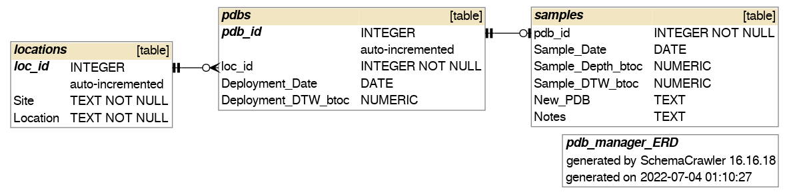

```{r setup, include=TRUE, message=FALSE}
knitr::opts_chunk$set(echo = TRUE)
options(scipen=999)

library(tidyverse)
library(lubridate)
library(RSQLite)
library(DBI)
```

\newpage

# Introduction

The modern environmental remediation industry in the United States began in the mid-1970s with the passing of the Clean Water Act and the Resource Conservation and Recovery Act. 
As Scientists and engineers began to collect data to solve the problems of environmental contamination these data were maintained in relational databases. 
Many of these original government databases are still in use!

A main focus of the environmental remediation effort is groundwater cleanup. 
Volatile organic compounds (VOC) are one of the most common classes of Contaminants of Concern (COC) at established groundwater cleanup sites in the US. 
Traditionally, concentrations of VOC contaminants in groundwater are monitored by pumping from a monitoring well the groundwater from the VOC-impacted geologic formation. 
However, recent technological developments have introduced the Passive Diffusion Bag (PDB) as a cost-effective alternative to pumping. 

The PDB is composed of a volume of laboratory-grade de-ionized water encapsulated in a diffusive membrane which allows for the passage of dissolved VOC contaminants. 
Once deployed to a well and lowered to the VOC-impacted geologic formation, a concentration gradient is formed between the null concentration of VOC within the PDB and the concentration of VOC in the VOC-impacted groundwater. 
This concentration gradient causes diffusion from the VOC-impacted groundwater to the de-ionized water in the PDB by diffusing the VOC molecules through the PDB membrane. 
The concentration of VOC in the PDB water equilibrates to the concentration of VOC in groundwater in approximately 2-weeks; after which, the PDB is collected and the water within is sampled to provide a representative sample of VOC concentration with the monitoring well. 

For data analysts managing sampling efforts for large sites involving thousands of wells, tracking PDBs in the wells can be time consuming and confusing.
It is necessary to know how long, or if, a PDB is in a well. PDBs must be assigned lot numbers, and other extraneous information must be tracked. 

The sections below describe initial stages of construction for a web application ([https://github.com/greenmmq/well_manager]('https://github.com/greenmmq/well_manager')) to manage PDB deployments at scale in numerous well.
The web application will be built in RShiny using a SQLite database as the backend.
An existing table, currently handled 'manually' by a data analyst, is cleaned and transformed into a normalized database for tracking well, their pdbs, and samples collected.

*TODO: Build PDB Lot Number Assignment feature*

\newpage

# Data Cleaning

The first step of this process is cleaning data from an existing table. 
Erroneous columns, strings into number vectors, and other errors have been entered in the past, so these things will be removed. 
Dates are formatted as UTC dates, however, SQLite does not have date formats so they will be stored as character vectors. 
They can then be operated on using SQLite's `datetime()` functions from the formatted character vector. 
The R code below executes this process. 

```{r}
# read-in data, drop useless columns, rows w/o sample dates, and null strings
pdb <- read.csv('PDB_Deployments.csv', 
                header=TRUE, na.strings = c('NA', 'NR', 'N/M', '')
                ) %>%
  select(-c(ID, X)) %>%
  filter(!is.na(Sample_Date))

# parse dates and convert to type text
# sqlite does not support dates/times
pdb$Deployment_Date <- as.character(parse_date_time(pdb$Deployment_Date, 'mdy'))
pdb$Sample_Date <- as.character(parse_date_time(pdb$Sample_Date, 'mdy'))

# preview
head(pdb)
```

\newpage

# Database Design

An RShiny web application with SQLite database combination is chosen for a few reasons:

1. RShiny is a popular web application platform for science and engineering professionals. Developing the application in RShiny will make it available on the preferred platform for a wide section of the app's target audience.

2. The application is designed to function on a project level, so the data contained will be somewhat isolated. Although thousands of pdbs may be processed every year, it is unlikely the scope of records the database will breach the low millions. SQLite is lightweight and can handle this amount of data. 

3. There is likely to be a relatively low I/O load on the server since PDBs are only processed in batches a couple/few times per year. Only a very small set of non-complicated actions will be allowed by the API. SQLite can handle both of these just fine.

The sections below walk-through the construction and design of the database from the data in the existing (now cleaned!) table.

## DB Setup

The first step is to initialize a SQLite database. 

```{r}
# setup sqlite database
conn <- dbConnect(RSQLite::SQLite(), dbname = "pdb_manager.db")
```

Next we will read-in the data from the original file as a table called `original`. 
This table will be normalized into other tables.  

```{r}
# write-in pdb table to database
dbWriteTable(conn, 'original', pdb)
```

\newpage

## CREATE `locations`

The `locations` table will index and hold all of the unique well identifiers, their *Location* name and *Site* name. This is outlined in the CREATE script below.

```{r, results='hide'}
# CREATE statement for the locations table
dbExecute(conn, 
          "
          CREATE TABLE locations (
            'loc_id' INTEGER PRIMARY KEY AUTOINCREMENT,
            'Site' TEXT NOT NULL,
            'Location' TEXT NOT NULL
          )
          ")
# INSERT statement for the locations table
dbExecute(conn,
          "
          INSERT INTO locations (Site, Location)
          SELECT DISTINCT Site, Location
          FROM original
          ORDER BY Site, Location
          ")
```

\newpage

## CREATE `intermediate`

The `intermediate` table will index all of the PDB entries by their *pdb_id*. This is outlined in the CREATE script below.

This table is a preparation for building out two more tables: the `pdbs` table; and, the `samples` table. 

```{r, results='hide'}
# CREATE statement for intermediate table
dbExecute(conn,
          "
          CREATE TABLE intermediate (
            pdb_id INTEGER PRIMARY KEY AUTOINCREMENT,
            loc_id INTEGER NOT NULL,
            Deployment_Date DATE NULL,
            Deployment_DTW_btoc NUMERIC NULL,
            Sample_Date DATE NULL,
            Sample_Depth_btoc TEXT NULL,
            Sample_DTW_btoc TEXT NULL,
            New_PDB TEXT NULL,
            Notes TEXT NULL,         
            FOREIGN KEY (loc_id)
              REFERENCES locations (loc_id)
          )
          ")
# CREATE statement for intermediate table
dbExecute(conn,
           "
           INSERT INTO intermediate (
             loc_id, 
             Deployment_Date, 
             Deployment_DTW_btoc,
             Sample_Date,
             Sample_Depth_btoc,
             Sample_DTW_btoc,
             New_PDB,
             Notes
           )
           SELECT 
	           l.loc_id, 
	   	       o.Deployment_Date, 
   		       o.Deployment_DTW_btoc,
   		       o.Sample_Date,
        	   o.Sample_Depth_btoc,
        	   o.Sampling_DTW_btoc,
        	   o.New_Bag_Deployed,
       		   o.Notes
           FROM original AS o
           JOIN locations AS l
           ON o.Site = l.Site AND o.Location = l.Location
           ")
```

\newpage

## CREATE `pdbs`

The `pdbs` table holds a 1-to-many association to the `locations` table through the *loc_id* foreign key, and contains the PDB deployment information. This is outlined in the CREATE script below.

*TODO: Add field for assigning PDB lot numbers*

```{r, results='hide'}
# CREATE statement for pdbs table
dbExecute(conn,
          "
          CREATE TABLE pdbs (
            pdb_id INTEGER PRIMARY KEY AUTOINCREMENT,
            loc_id INTEGER NOT NULL,
            Deployment_Date DATE NULL,
            Deployment_DTW_btoc NUMERIC NULL,
            FOREIGN KEY (loc_id)
              REFERENCES locations (loc_id)
          )
          ")
# INSERT statement for pdbs table
dbExecute(conn,
           "
           INSERT INTO pdbs (
             pdb_id,
             loc_id,
             Deployment_Date,
             Deployment_DTW_btoc
           )
           SELECT 
             pdb_id,
             loc_id,
             Deployment_Date,
             Deployment_DTW_btoc
           FROM intermediate
           ")
```

\newpage

## CREATE `samples`

The `samples` table holds a 1-to-1 association to the `pdbs` table through the *pdb_id* foreign key, and contains the sample collection information. This is outlined in the CREATE script below.

```{r, results='hide'}
# CREATE statement for samples table
dbExecute(conn,
          "
          CREATE TABLE samples (
            pdb_id INTEGER NOT NULL,
            Sample_Date DATE NULL,
            Sample_Depth_btoc NUMERIC NULL,
            Sample_DTW_btoc NUMERIC NULL,
            New_PDB TEXT NULL,
            Notes TEXT NULL,
            UNIQUE(pdb_id),
            FOREIGN KEY (pdb_id)
              REFERENCES pdbs (pdb_id)
          )
          ")
# INSERT statement for samples table
dbExecute(conn,
           "
           INSERT INTO samples (
             pdb_id,
             Sample_Date,
             Sample_Depth_btoc,
             Sample_DTW_btoc,
             New_PDB,
             Notes
           )
           SELECT 
	           pdb_id, 
	   	       Sample_Date,
        	   Sample_Depth_btoc,
        	   Sample_DTW_btoc,
        	   New_PDB,
       		   Notes
           FROM intermediate
           ")
```

\newpage

## DROP Formative Tables 

With our database now constructed using the scripts above, the "helper" tables `original` and `intermediate` can be dropped. 

```{r, results='hide'}
# DROP statements for original and intermediate tables
dbExecute(conn,"DROP TABLE IF EXISTS original")
dbExecute(conn,"DROP TABLE IF EXISTS intermediate")
```

```{r}
dbListTables(conn)
dbDisconnect(conn)
```

## Database Design Comments

An ERD diagram for the database constructed above was constructed using [SchemaCrawler WebApp](https://schemacrawler-webapp.herokuapp.com/) and is shown below. 

The `locations` table holds the individual locations where a PDB could be dployed. The `pdbs` table holds data concerning the PDB deployment, and the `samples` table holds data concerning the sampling information upon collection of a given PDB. 



\newpage

# Queries

The sections below describe the various CRUD operations of the PDB deployment, collection, and management process. 

*TODO: Add Update function for assigning lot numbers to PDBs in the pdbs table*

## CREATE Functions

### `createWell()`

This function adds a new monitoring well location to the `locations` table. 

```{r}
# query to create a new well
createWell = function(site, location){
  dbExecute(conn,
            "INSERT INTO locations (Site, Location) VALUES (?, ?)",
            params=c(site, location)
            )
}
```

### `deployPDB()`

This function deploys a new PDB to a well. However, it first checks if there is an existing PDB in the specified well. If there is, then the function errors out. Otherwise it adds the new PDB deployment information to the `pdbs` table, and writes an empty record to the `samples` table 

```{r}
# query to deploy a PDB
deployPDB = function(site, name, date, dtw){
  # get the specified loc_id
  locid = dbGetQuery(conn,
                     "
                     SELECT loc_id FROM locations WHERE Site = ? AND Location = ?
                     ",
                     params=c(site, name)
                     )$loc_id
  
  # determine if a pdb is deployed by getting the max pdb_id of...
  # ... any pdbs not yet sampled IE Sample_Date is null
  status = dbGetQuery(conn, 
                      "
                      SELECT 
                        MAX(p.pdb_id) AS 'status'
                      FROM pdbs AS p
                      INNER JOIN (
                        SELECT pdb_id, Sample_Date
                        FROM samples
                        WHERE Sample_Date IS NULL
                      ) AS s
                      ON p.pdb_id = s.pdb_id
                      WHERE loc_id = ?
                      ",
                      params=c(locid)
                      )$status
  # if a pdb exists, error message and end function
  # indicate pdb_id and deployment date of existing well to user
  if (!is.na(status)) {
    existing = dbGetQuery(conn,
                          "
                          SELECT 
                            MAX(pdb_id) AS 'pdb',
                            Deployment_Date AS 'date'
                          FROM pdbs
                          WHERE loc_id = ?
                          ",
                          params=c(locid)
                          )
    paste('Error! - PDB ID:', existing$pdb,
          ' already deployed to well:', name, 
          ' on:', existing$date, '.'
          )
  } else { # insert deployment details into pdbs table
      dbExecute(conn,
                "
                INSERT INTO pdbs (loc_id, Deployment_Date, Deployment_DTW_btoc)
                VALUES (?, DATE(?), ?)
                ",
                params=c(locid, date, dtw)
                )
      
      # find the new pdb_id
      max = dbGetQuery(conn, "SELECT MAX(pdb_id) AS 'max' FROM pdbs")$max
      
      # create a new sample associated to the pdb_id
      dbExecute(conn,
                "
                INSERT INTO samples (pdb_id)
                VALUES (?)
                ",
                params=c(max)
                )
  }
}
```

\newpage

## UPDATE Functions

### `collectPDB()`

This function collects a PDB existing in a given well. However, if first checks if there is a PDB in the well. If there is not, then the function errors out. If there is, then the sample information is recorded into the `samples` table. If it is indicated that another PDB was redeployed, then this information is added to the `pdbs` table.

```{r}
# query to collect a PDB
collectPDB = function(site, name, date, dtw, depth, pdb, notes){
  # finds max pdb_id not yet sampled at the given location 
  pdbid = dbGetQuery(conn,
                     "
                     SELECT MAX(s.pdb_id) AS 'max'
                     FROM pdbs AS p
                       INNER JOIN (
                         SELECT loc_id
                         FROM locations
                         WHERE Site = ? AND Location = ?
                       ) AS l
                       ON p.loc_id = l.loc_id
                       INNER JOIN (
                         SELECT pdb_id
                         FROM samples
                         WHERE Sample_Date IS NULL
                       ) AS s
                       ON p.pdb_id = s.pdb_id
                     ",
                     params=c(site, name)
                     )$max
  # pdbid is null IE no pdbid has a null Sample_Date then error out
  if (is.na(pdbid)) {
    paste('Error! - There is no PDB deployed in well:', name, '.')
  } else { # update the sample associated with the pdbid queried above
      dbExecute(conn, 
                "
                UPDATE samples
                SET 
                  Sample_Date = DATE(?), 
                  Sample_DTW_btoc = ?,
                  Sample_Depth_btoc = ?, 
                  New_PDB = ?,
                  Notes = ?
                WHERE pdb_id = ?;
                ",
                params=c(date, dtw, depth, pdb, notes, pdbid)
                )
      
      # redeploy a new pdb if indicated
      if (pdb == "Y") {
        deployPDB(site, name, date, dtw)
      }
  }
}
```

\newpage

## READ Functions

### All Data

These functions allow to read all the PDB data from all sites/locations between a given date range. 

### `selectAllDeployedRange()`

```{r}
# query to view all data deployed between date range
selectAllDeployedRange = function(after='1900-01-01', before='2100-01-01'){
  dbGetQuery(conn,
             "
             SELECT 
               l.Site, l.Location, p.Deployment_Date, p.Deployment_DTW_btoc,
               s.Sample_Date, s.Sample_DTW_btoc, s.Sample_Depth_btoc, 
               s.New_PDB, s.Notes
             FROM pdbs AS p
               INNER JOIN (
                 SELECT *
                 FROM locations
               ) AS l
               ON p.loc_id = l.loc_id
               INNER JOIN (
                 SELECT *
                 FROM samples
               ) AS s
               ON p.pdb_id = s.pdb_id
             WHERE DATE(p.Deployment_Date) >= DATE(?) 
               AND DATE(p.Deployment_Date) < DATE(?)
             ORDER BY Site, Location, DATE(s.Sample_Date) DESC
             ",
             params=c(after, before)
             )
}
```

### `selectAllSampledRange()`

```{r}
# query to view all data sampled between date range
selectAllSampledRange = function(after='1900-01-01', before='2100-01-01'){
  dbGetQuery(conn,
             "
             SELECT 
               l.Site, l.Location, p.Deployment_Date, p.Deployment_DTW_btoc,
               s.Sample_Date, s.Sample_DTW_btoc, s.Sample_Depth_btoc, 
               s.New_PDB, s.Notes
             FROM pdbs AS p
               INNER JOIN (
                 SELECT *
                 FROM locations
               ) AS l
               ON p.loc_id = l.loc_id
               INNER JOIN (
                 SELECT *
                 FROM samples
               ) AS s
               ON p.pdb_id = s.pdb_id
             WHERE DATE(s.Sample_Date) >= DATE(?) 
               AND DATE(s.Sample_Date) < DATE(?)
             ORDER BY Site, Location, DATE(s.Sample_Date) DESC
             ",
             params=c(after, before)
             )
}
```

\newpage

### Site-level Data

These functions allow to read all the PDB data from a given site between a given date range. 

### `selectSiteDeployedRange()`

```{r}
# query to view all data from one site deployed between date range
selectSiteDeployedRange = function(site, after='1900-01-01', before='2100-01-01'){
  dbGetQuery(conn,
             "
             SELECT 
               l.Site, l.Location, p.Deployment_Date, p.Deployment_DTW_btoc,
               s.Sample_Date, s.Sample_DTW_btoc, s.Sample_Depth_btoc, 
               s.New_PDB, s.Notes
             FROM pdbs AS p
               INNER JOIN (
                 SELECT *
                 FROM locations
                 WHERE Site = ?
               ) AS l
               ON p.loc_id = l.loc_id
               INNER JOIN (
                 SELECT *
                 FROM samples
               ) AS s
               ON p.pdb_id = s.pdb_id
             WHERE DATE(p.Deployment_Date) >= DATE(?) 
               AND DATE(p.Deployment_Date) < DATE(?)
             ORDER BY Site, Location, DATE(s.Sample_Date) DESC
             ",
             params=c(site, after, before)
             )
}
```

### `selectSiteSampledRange()`

```{r}
# query to view all data from one site sampled between date range
selectSiteSampledRange = function(site, after='1900-01-01', before='2100-01-01'){
  dbGetQuery(conn,
             "
             SELECT 
               l.Site, l.Location, p.Deployment_Date, p.Deployment_DTW_btoc,
               s.Sample_Date, s.Sample_DTW_btoc, s.Sample_Depth_btoc, 
               s.New_PDB, s.Notes
             FROM pdbs AS p
               INNER JOIN (
                 SELECT *
                 FROM locations
                 WHERE Site = ?
               ) AS l
               ON p.loc_id = l.loc_id
               INNER JOIN (
                 SELECT *
                 FROM samples
               ) AS s
               ON p.pdb_id = s.pdb_id
             WHERE DATE(s.Sample_Date) >= DATE(?) 
               AND DATE(s.Sample_Date) < DATE(?)
             ORDER BY Site, Location, DATE(s.Sample_Date) DESC
             ",
             params=c(site, after, before)
             )
}
```

\newpage

### Location-level Data

These functions allow to read all the PDB data from a given sites/location combination between a given date range. 

### `selectLocationDeployedRange()`

```{r}
# query to view all data from one location deployed between date range
selectLocationDeployedRange = function(site, name, after='1900-01-01', before='2100-01-01'){
  dbGetQuery(conn,
             "
             SELECT 
               l.Site, l.Location, p.Deployment_Date, p.Deployment_DTW_btoc,
               s.Sample_Date, s.Sample_DTW_btoc, s.Sample_Depth_btoc, 
               s.New_PDB, s.Notes
             FROM pdbs AS p
               INNER JOIN (
                 SELECT *
                 FROM locations
                 WHERE Site = ? AND Location = ?
               ) AS l
               ON p.loc_id = l.loc_id
               INNER JOIN (
                 SELECT *
                 FROM samples
               ) AS s
               ON p.pdb_id = s.pdb_id
             WHERE DATE(p.Deployment_Date) >= DATE(?) 
               AND DATE(p.Deployment_Date) < DATE(?)
             ORDER BY Site, Location, DATE(s.Sample_Date) DESC
             ",
             params=c(site, name, after, before)
             )
}
```

### `selectLocationSampledRange()`

```{r}
# query to view all data from one location sampled between date range
selectLocationSampledRange = function(site, name, after='1900-01-01', before='2100-01-01'){
  dbGetQuery(conn,
             "
             SELECT 
               l.Site, l.Location, p.Deployment_Date, p.Deployment_DTW_btoc,
               s.Sample_Date, s.Sample_DTW_btoc, s.Sample_Depth_btoc, 
               s.New_PDB, s.Notes
             FROM pdbs AS p
               INNER JOIN (
                 SELECT *
                 FROM locations
                 WHERE Site = ? AND Location = ?
               ) AS l
               ON p.loc_id = l.loc_id
               INNER JOIN (
                 SELECT *
                 FROM samples
               ) AS s
               ON p.pdb_id = s.pdb_id
             WHERE DATE(s.Sample_Date) >= DATE(?) 
               AND DATE(s.Sample_Date) < DATE(?)
             ORDER BY Site, Location, DATE(s.Sample_Date) DESC
             ",
             params=c(site, name, after, before)
             )
}
```

\newpage

# Personal Assessment

I had initially began this project in Python Flask with a MongoDB database. At the time, I really liked the idea of modeling this data from an object-oriented approach. This is not often done in the environmental industry and I think there is tremendous potential for document databases for certain applications within the "enviro-stack". 

I had a Jupyter notebook accomplishing more or less the same as above in MongoDB using pandas, except I could not get the query logic down for the PDB deployment and collection workflow. It was simply too complex, at least for me of little document database knowledge. 

I decided to switch gears, since I knew I could do this in SQL. RShiny and SQLite are a nice pair and are able to easily handle the nuance of the PDB workflow while remaining lightweight. The Jupyter Notebook output from that little exploration is also included in my submission if you are curious. 

As for my progress, I'd rate the following: 

## 1. Conceptual Schema

I like the schema for the MongoDB better, but this is still good and efficient. Makes read/write operations relatively simple. And flexible and ready to have more relations added if necessary. 

I still want to add a function to assign lot numbers bIy deployment date ranges. Therefore, I would rate my effort so far as 8/10 for incompleteness. 

## 2. Database

I think the database is well constructed despite missing the lot number assignment feature. The inputs and updates are strictly constrained and the reads are comprehensive. 

Since it is an archive db, there is no 'delete' functionality made available to the average API user. Admin only! I would rate this effort also an 8/10, due to the incompleteness. 

## 3. Code

I think my code notation is good, and the functions are sensibly and efficiently coded. They will fit very well into the ui inputs for the RShiny application. I rate my performance here as 9/10, since I am sure there is more I can improve upon. 
